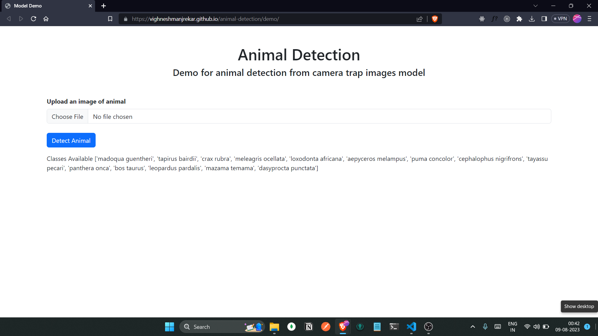

# Wildlife Detection and Evaluation From Camera Trap images Using Deep Learning

Welcome to the Wildlife Detection and Evaluation From Camera Trap images Using Deep Learning! This deep learning model is built using the Detectron2 framework and utilizes the Mask R-CNN architecture for instance segmentation. The primary goal of this project is to detect animals in camera trap images, providing valuable insights into wildlife monitoring and conservation efforts.

## Features

- **Mask R-CNN Instance Segmentation**: The model uses the Mask R-CNN architecture for accurate instance segmentation, distinguishing animals from the background in camera trap images.

- **Detectron2 Framework**: Detectron2, a state-of-the-art object detection and segmentation framework, is used for building, training, and deploying the model.

- **API Endpoint**: This repository serves as an API endpoint that allows users to send images to the model and receive predictions for animal instances.

- **Dockerized**: The API endpoint is dockerized, allowing for easy deployment and scalability.

- **GPU Support**: The model can be trained and deployed on a GPU for faster training and inference.

- **Transfer Learning**: The model uses transfer learning to leverage the pre-trained weights of the COCO dataset, which contains 14 classes.

- **Hyperparameter Tuning**: The model uses hyperparameter tuning to find the optimal learning rate and number of iterations for training.

## Award

This project won the Primal Research Ideas in Science and Management, 2022 (PRISM 2022), a research idea contest organized by CHRIST (Deemed to be University) in association with Indo-Korea Science and Technology Center.

[certificate](https://drive.google.com/file/d/1xTxkiqkk9dBKta4k0ggCZrSjthg-PVo1/view)

## Demo

Click on the image above to watch the demo video.